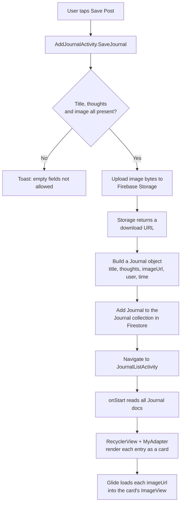
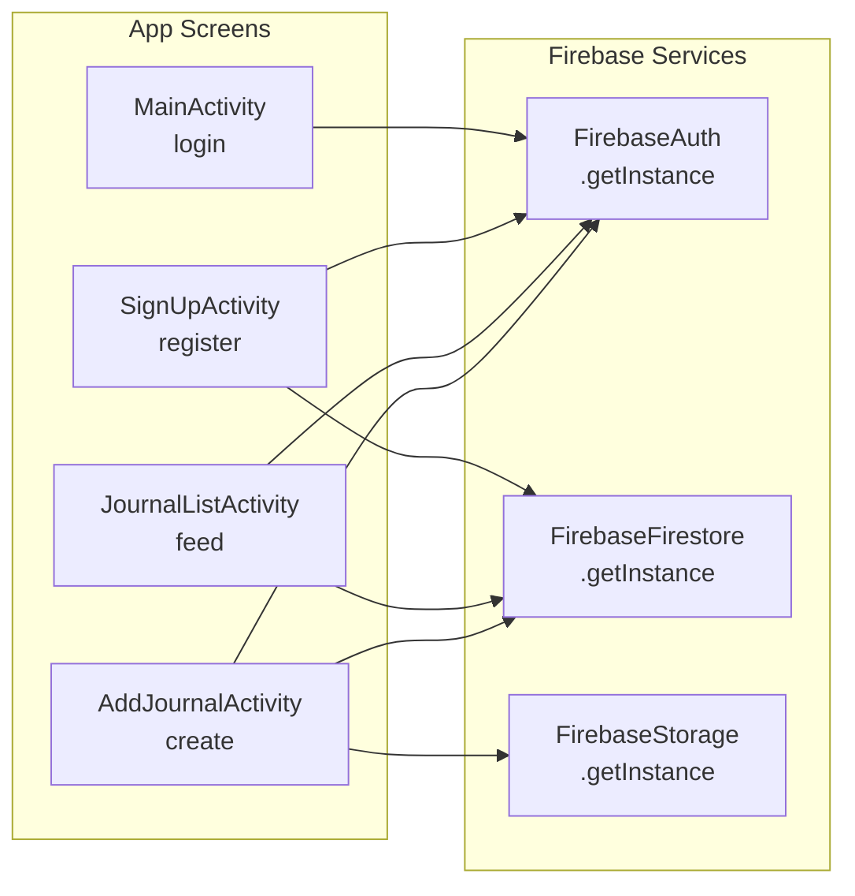
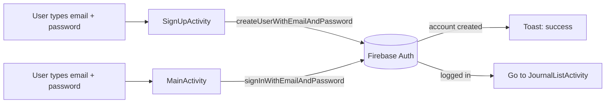
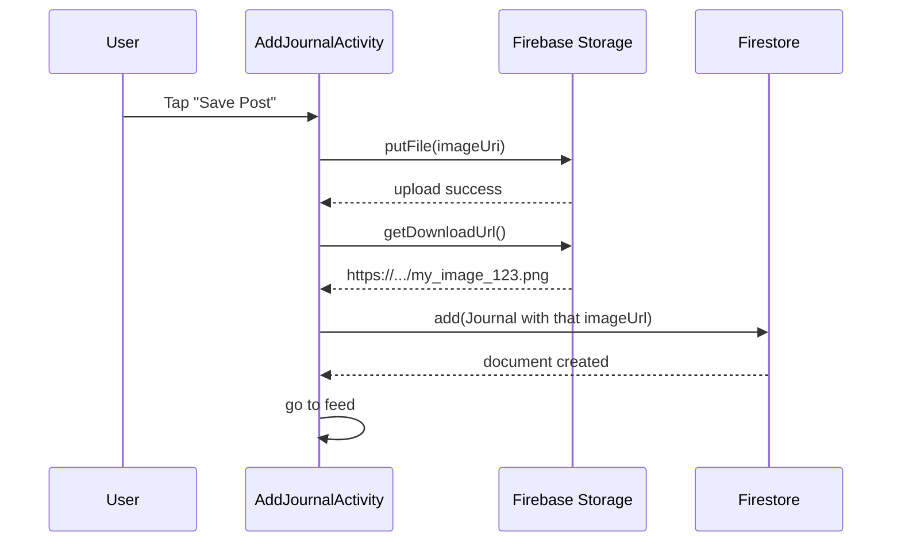
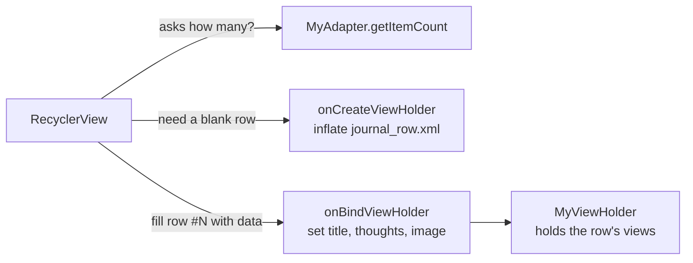
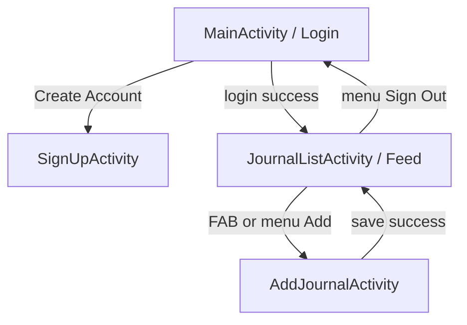
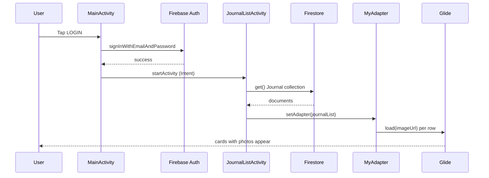

# 📓 JournalApp — A Beginner-Friendly Guide & Code Walkthrough

> A simple Android journaling app where users sign up, log in, and post journal entries (a photo, a title, and their thoughts) to a shared feed — all powered by Firebase.

This README is **two things at once**:

1. A **learning document** that teaches the concepts from scratch.
2. A **code walkthrough** that shows how *this specific app* uses them.

> 💡 **Tip:** You don't need to read this top-to-bottom. Use the table of contents to jump around. But if you're new to Android + Firebase, the order below is designed so each idea builds on the last.

---

## 📑 Table of Contents

- [1. TL;DR and What You'll Learn](#1-tldr-and-what-youll-learn)
- [2. The Big Picture (Visual First)](#2-the-big-picture-visual-first)
- [3. Project Structure](#3-project-structure)
- [4. Concept-by-Concept Deep Dives](#4-concept-by-concept-deep-dives)
    - [4.1 Gradle Dependencies & the Firebase BoM](#41-gradle-dependencies--the-firebase-bom)
    - [4.2 The AndroidManifest (the app's front door)](#42-the-androidmanifest-the-apps-front-door)
    - [4.3 XML Layouts](#43-xml-layouts)
    - [4.4 The `Journal` Model (a data class)](#44-the-journal-model-a-data-class)
    - [4.5 Firebase Authentication](#45-firebase-authentication)
    - [4.6 Cloud Firestore (the data store)](#46-cloud-firestore-the-data-store)
    - [4.7 Cloud Storage + the image upload flow](#47-cloud-storage--the-image-upload-flow)
    - [4.8 RecyclerView, Adapter & ViewHolder](#48-recyclerview-adapter--viewholder)
    - [4.9 Glide (loading images from the internet)](#49-glide-loading-images-from-the-internet)
    - [4.10 ActivityResultLauncher (picking a photo)](#410-activityresultlauncher-picking-a-photo)
    - [4.11 Activities, Lifecycle & Intent Navigation](#411-activities-lifecycle--intent-navigation)
- [5. End-to-End Walkthrough](#5-end-to-end-walkthrough)
- [6. Glossary](#6-glossary)
- [7. Suggested Enhancements](#7-suggested-enhancements)
- [8. Further Reading](#8-further-reading)

---

## 1. TL;DR and What You'll Learn

**Elevator pitch:** JournalApp is a small social-journaling Android app written in **Java**. A user creates an account, logs in, and lands on a feed of journal entries. They can add their own entry — a picture from their gallery, a title, and a paragraph of thoughts — which is saved to the cloud and shown to everyone. The image lives in **Firebase Storage**, the text lives in **Cloud Firestore**, and accounts are handled by **Firebase Authentication**.

**By the end you'll understand:**

- How an Android app is wired together from Activities, layouts, and a manifest
- What **Firebase** is and how its three services (Auth, Firestore, Storage) divide the work
- Why we model data with a plain Java class (a **POJO**) and how Firestore turns it into a document
- How a **RecyclerView** shows a scrolling list efficiently, and the **Adapter/ViewHolder** pattern behind it
- How **Glide** loads a photo from a URL into an `ImageView` without freezing the app
- How the modern **ActivityResultLauncher** API lets you pick an image from the gallery
- How screens hand off to each other using **Intents**

**Prerequisites:**

- Basic **Java** syntax (classes, methods, `if`/`else`, anonymous inner classes / lambdas)
- You've seen Android Studio and know an app is made of "screens," but the details are fuzzy
- No prior Firebase experience needed — we start from zero

**Estimated reading time:** ~35–45 minutes for a careful first pass.

> 🤔 **Why?:** This app uses a **classic, Activity-based architecture** — no ViewModel, no dependency-injection framework, no Paging library. That's deliberately simpler than a "production" app, which makes it a great place to learn the fundamentals before adding fancier patterns. Where modern apps would do something differently, this guide will say so.

---

## 2. The Big Picture (Visual First)

### 🗺️ The "small town" analogy

Think of the whole app as a **small town**:

- **The townspeople** are your **Activities** — each one is a building you can walk into (the Login building, the Sign-Up building, the Feed building, the Add-Entry building).
- **The roads between buildings** are **Intents** — you use one to travel from the Login building to the Feed building.
- **Firebase** is the **town's shared infrastructure**, run by an outside utility company you don't have to build yourself:
    - **Authentication** is the **front-gate security guard** who checks IDs.
    - **Firestore** is the **public library** where everyone's written entries are filed as index cards.
    - **Storage** is the **warehouse** where the big, bulky items (photos) are kept; the library only keeps a *paper slip* (a URL) telling you which shelf the photo is on.

### 📊 Data flow: what happens when a user saves a journal entry



> 🔑 **Key idea:** Notice the **two-step save**. The photo goes to **Storage** first; only *after* Storage hands back a URL do we write the text entry (with that URL inside it) to **Firestore**. The database never holds the image itself — only a link to it. This keeps the database small and fast.

### 🧩 "What provides what" — the Firebase wiring

Real production apps use a *dependency-injection* framework (like Hilt) to hand out objects. This app does it the simple way: every screen asks Firebase for a shared **singleton** instance directly. Here's the resulting wiring:



> 🤔 **Why?:** Each `FirebaseXxx.getInstance()` always returns the **same shared object** for the app. So even though four screens each "ask for" Firestore, they're all talking to one client under the hood. That's what a *singleton* means.

### Before we dive in: why this architecture exists

A naive first attempt at an app like this might try to do *everything* inside one giant Activity, store data in a local file, and load images on the main thread. That breaks fast:

- **Storing data locally** means entries vanish when the app is uninstalled and can't be shared between users. → *Firestore solves this with a cloud database.*
- **Loading a photo on the main thread** freezes the UI for seconds. → *Glide solves this by loading in the background.*
- **Building a scrolling list by creating one view per item** runs out of memory with long lists. → *RecyclerView solves this by recycling a handful of views.*
- **Rolling your own login/password storage** is a security nightmare. → *Firebase Auth solves this — you never touch raw passwords.*

Every library here exists to make one of those hard problems disappear.

---

## 3. Project Structure

```
JournalApp/
├── app/
│   ├── google-services.json          # Firebase project config (links app ↔ Firebase)
│   ├── build.gradle.kts              # App-level dependencies & build settings
│   └── src/main/
│       ├── AndroidManifest.xml       # App "table of contents": screens, permissions, icon
│       ├── java/com/vineetganti/journalapp/
│       │   ├── MainActivity.java         # Login screen (the LAUNCHER / entry point)
│       │   ├── SignUpActivity.java       # Create-account screen
│       │   ├── JournalListActivity.java  # The feed of all journal entries
│       │   ├── AddJournalActivity.java   # Form to create a new entry + upload photo
│       │   ├── Journal.java              # Data model for one journal entry (a POJO)
│       │   └── MyAdapter.java            # Bridges the Journal list ↔ the RecyclerView
│       └── res/
│           ├── layout/
│           │   ├── activity_main.xml          # Login UI
│           │   ├── activity_sign_up.xml       # Sign-up UI
│           │   ├── activity_journal_list.xml  # Feed UI (RecyclerView + FAB)
│           │   ├── activity_add_journal.xml   # Add-entry form UI
│           │   └── journal_row.xml            # The layout for ONE card in the feed
│           ├── menu/my_menu.xml          # The "add" / "sign out" overflow menu
│           ├── drawable/                 # Gradients, input outlines, etc.
│           └── mipmap/                   # App launcher icons
```

> 💡 **Tip for true beginners:** In Android, **`java/`** holds your *logic* (Java code) and **`res/`** holds your *resources* (anything not code: layouts, images, colors, strings). The two are linked by a generated class called `R`. When you write `R.layout.activity_main`, you're saying "the layout file named `activity_main.xml`." When you write `R.id.email`, you mean "the view whose `android:id` is `@+id/email`." `R` is the phone book that connects code to resources.

---

## 4. Concept-by-Concept Deep Dives

Each concept below follows the same rhythm: **the idea in plain English → a visual → how this app uses it → common pitfalls.** Concepts are ordered so the foundations come first and the UI comes last.

---

### 4.1 Gradle Dependencies & the Firebase BoM

#### 🧠 The Concept (Plain English)

**Analogy:** Gradle is your app's **grocery shopping list and chef combined**. The `build.gradle.kts` file lists every ingredient (library) your app needs; Gradle goes and fetches each one, then "cooks" (compiles) everything into one installable app.

**Technical definition:** Gradle is the **build system**. A *dependency* is an external library your code relies on. You declare each in the `dependencies { }` block and Gradle downloads it automatically.

**Why it exists:** So you don't copy-paste other people's code by hand or worry about which versions work together. You just name what you want.

#### 🎨 Visual Aid

| Dependency | What it does | Why this app needs it |
|---|---|---|
| `firebase-bom` | A "version manifest" for all Firebase libs | Keeps every Firebase library on compatible versions |
| `firebase-auth` | Login / sign-up | Email-password accounts |
| `firebase-firestore` | Cloud NoSQL database | Stores journal entries & users |
| `firebase-storage` | File storage | Stores the photos |
| `firebase-analytics` | Usage metrics | Optional; tracks app usage |
| `glide` | Image loading | Downloads & displays photos from URLs |
| `appcompat` / `material` | UI building blocks | Buttons, FAB, themes that work on old Androids |
| `constraintlayout` | Flexible layout engine | Positions views on every screen |

#### 💻 How This App Uses It

```kotlin
// build.gradle.kts
implementation(platform("com.google.firebase:firebase-bom:34.14.0"))
implementation("com.google.firebase:firebase-firestore")
implementation("com.google.firebase:firebase-auth")
implementation("com.google.firebase:firebase-storage")

implementation("com.github.bumptech.glide:glide:4.15.1")
annotationProcessor("com.github.bumptech.glide:compiler:4.15.1")
```

The **most important lines** here:

- `platform("...firebase-bom:34.14.0")` — **BoM** stands for *Bill of Materials*. Notice the Firebase lines *below* it have **no version numbers**. That's the point: the BoM picks compatible versions for you, so Auth, Firestore, and Storage never clash.
- `id("com.google.gms.google-services")` (in the `plugins` block at the top) — this plugin reads your `google-services.json` and injects your project's keys at build time. Without it, Firebase wouldn't know *which* cloud project to talk to.

> 🤔 **Why two Glide lines?** `glide` is the library you call; `compiler` (an `annotationProcessor`) generates extra helper code at build time. Both are needed for Glide's full feature set.

#### ⚠️ Common Pitfalls

1. **Forgetting the google-services plugin** → app compiles but crashes on the first Firebase call. Make sure the `id("com.google.gms.google-services")` plugin line is present.
2. **Pinning Firebase versions manually while also using the BoM** → version conflicts. Let the BoM do its job; leave Firebase lines version-less.
3. **`google-services.json` in the wrong folder** → build fails. It must sit in the `app/` module folder.

---

### 4.2 The AndroidManifest (the app's front door)

#### 🧠 The Concept (Plain English)

**Analogy:** The manifest is the **building directory in a lobby**. It lists every room (Activity), which door is the *main entrance*, and what permissions the building has (e.g., "this building is allowed to use the phone lines").

**Why it exists:** Android needs a single, trusted file that declares everything the app contains *before* it runs, for security and so the OS knows how to launch it.

#### 💻 How This App Uses It

```xml
<uses-permission android:name="android.permission.INTERNET" />
...
<activity android:name=".MainActivity" android:exported="true">
    <intent-filter>
        <action android:name="android.intent.action.MAIN" />
        <category android:name="android.intent.category.LAUNCHER" />
    </intent-filter>
</activity>
```

- The **`INTERNET` permission** is what lets the app reach Firebase at all. No internet permission, no cloud.
- The **`<intent-filter>` with `MAIN` + `LAUNCHER`** on `MainActivity` is what makes it the *entry point* — the screen that opens when you tap the app icon. The other three activities have `android:exported="false"`, meaning only this app can open them (good for security).

#### ⚠️ Common Pitfalls

1. **Adding a new Activity but forgetting to declare it here** → crash with `ActivityNotFoundException` when you try to navigate to it.
2. **Two activities both marked as `LAUNCHER`** → confusing double launcher icons.

---

### 4.3 XML Layouts

#### 🧠 The Concept (Plain English)

**Analogy:** A layout file is a **blueprint for a room**. It says "put a label here, a text box below it, a button at the bottom." The Java code is the *electrician* who later wires those fixtures up to do something.

**Why it exists:** Separating *what the screen looks like* (XML) from *what it does* (Java) keeps both simpler. Designers can tweak the look without touching logic.

#### 🎨 Visual Aid — the feed screen's structure

```
ConstraintLayout (activity_journal_list.xml)
├── RecyclerView  ........ fills the screen, shows the scrolling list
└── FloatingActionButton . floats bottom-right, the "+" to add an entry
```

And each row in that list (`journal_row.xml`) is its own little blueprint:

```
CardView (a rounded, shadowed card)
├── LinearLayout (horizontal) → username + share button
└── LinearLayout (vertical)
    ├── ImageView ...... the journal photo
    ├── TextView ....... title
    ├── TextView ....... thoughts
    └── TextView ....... "x minutes ago"
```

#### 💻 How This App Uses It

Every screen's layout is loaded in `onCreate` via `setContentView(R.layout.activity_main)`. The key view types this app uses:

- **`ConstraintLayout`** — the most flexible layout. Each child says who it's anchored to (e.g., `app:layout_constraintTop_toBottomOf="@id/email"` means "sit just below the email field"). Think of it as pinning views to each other and to the screen edges.
- **`RecyclerView`** — an empty container for a scrolling list (see [4.8](#48-recyclerview-adapter--viewholder)).
- **`CardView`** — a rectangle with rounded corners and a drop shadow, used for each journal row.
- **`FloatingActionButton` (FAB)** — the circular action button; here it opens the Add-Entry screen.

> 🔑 **Key idea:** The `android:id="@+id/email"` in XML is what lets Java find the view later with `findViewById(R.id.email)`. The `@+id/` syntax means "create this ID"; later references use `@id/` (no plus).

#### ⚠️ Common Pitfalls

1. **A view with no constraints in `ConstraintLayout`** silently jumps to the top-left corner at runtime even though it looked fine in the preview.
2. **Typo between the XML id and the `findViewById` call** → `NullPointerException` when you touch that view.
3. **Forgetting `tools:context`** — harmless, but it's what powers the editor preview.

---

### 4.4 The `Journal` Model (a data class)

#### 🧠 The Concept (Plain English)

**Analogy:** A model class is a **labeled form**. One blank `Journal` form has fields for *title, thoughts, photo link, author, time*. Filling one out = creating one journal entry. A stack of filled forms = your feed.

**Why it exists:** Passing around six loose variables (title, thoughts, url…) everywhere is error-prone. Bundling them into one `Journal` object keeps related data together and lets Firestore convert between objects and database documents automatically.

#### 💻 How This App Uses It

```java
public class Journal {
    private String title;
    private String thoughts;
    private String imageUrl;
    private String userId;
    private Timestamp timeAdded;
    private String userName;

    public Journal() { }   // ← required empty constructor
    // ... getters and setters for every field ...
}
```

The **two most important things** about this class:

- **The empty constructor `public Journal() {}`** is *mandatory* for Firestore. When Firestore reads a document back, it creates a blank `Journal` then calls each setter. No empty constructor → crash on read.
- **Every field has a public getter/setter.** Firestore uses these (via reflection) to map fields ↔ document keys. A field named `imageUrl` becomes a document field `"imageUrl"`.

This conversion happens in two places:

```java
// Writing: AddJournalActivity builds and saves a Journal
Journal journal = new Journal();
journal.setTitle(title);
collectionReference.add(journal);   // object → document

// Reading: JournalListActivity turns a document back into a Journal
Journal journal = journalDoc.toObject(Journal.class);   // document → object
```

> 🔑 **Key idea:** A class like this — only fields plus getters/setters, no real logic — is called a **POJO** (Plain Old Java Object). It's pure data.

#### ⚠️ Common Pitfalls

1. **Removing the empty constructor** → `toObject()` crashes at runtime.
2. **Field names that don't match what you query/order by** → silent empty results.
3. **Using primitive types (`int`, `long`) for fields that might be missing** in Firestore → crashes; prefer object types (`Integer`, `String`).

---

### 4.5 Firebase Authentication

#### 🧠 The Concept (Plain English)

**Analogy:** Auth is the **bouncer at the door** who manages the guest list. You hand them an email + password; they verify it and give you a wristband (a logged-in `FirebaseUser`). You never store the master guest list yourself — and crucially, you never see anyone's actual password.

**Why it exists:** Securely storing passwords is genuinely hard and dangerous to get wrong. Firebase handles hashing, breaches, and resets so you don't.

**Where it's used in real apps:** Practically every app with a "Sign in" button.

#### 🎨 Visual Aid



#### 💻 How This App Uses It

Getting the auth client is the same everywhere — a singleton:

```java
firebaseAuth = FirebaseAuth.getInstance();
```

**Creating an account** (`SignUpActivity`):

```java
firebaseAuth.createUserWithEmailAndPassword(email, pass)
    .addOnCompleteListener(task -> {
        if (task.isSuccessful()) {
            // account exists now
        }
    });
```

**Logging in** (`MainActivity`):

```java
firebaseAuth.signInWithEmailAndPassword(email, pwd)
    .addOnSuccessListener(authResult -> {
        startActivity(new Intent(MainActivity.this, JournalListActivity.class));
    });
```

**Who is logged in right now?** Any screen can ask:

```java
FirebaseUser user = firebaseAuth.getCurrentUser();   // null if signed out
```

`JournalListActivity` uses this to gate the "add" and "sign out" menu actions, and `AddJournalActivity` reads `user.getUid()` to stamp each entry with its author.

> 🔑 **Key idea — everything is asynchronous.** Talking to Firebase takes time (it's a network call). So instead of returning a result immediately, these methods return a **`Task`**, and you attach listeners (`addOnSuccessListener`, `addOnCompleteListener`) that fire *later*, when the answer arrives. Your code keeps running in the meantime; the UI never freezes.

#### ⚠️ Common Pitfalls

1. **This app never saves the username.** `SignUpActivity` collects a username but never stores it — it isn't written to the user profile *or* to Firestore. So later, `AddJournalActivity`'s `user.getDisplayName()` returns `null`. **Fix:** after sign-up, call `user.updateProfile(new UserProfileChangeRequest.Builder().setDisplayName(username).build())`.
2. **Weak passwords / bad emails throw errors you must handle.** Always add an `addOnFailureListener` and show the message, or the user sees nothing happen.
3. **`MainActivity` has a brace bug** — the `logEmailPassUser` method's closing braces are misplaced, so the sign-in block falls outside the method and it won't compile. Re-check the braces before testing login.

---

### 4.6 Cloud Firestore (the data store)

#### 🧠 The Concept (Plain English)

**Analogy:** Firestore is a **library of filing cabinets**. A **collection** is a cabinet (e.g., the `"Journal"` cabinet). A **document** is one folder inside it (one journal entry). Each document holds **fields** (title, thoughts, time…). Unlike a spreadsheet, folders don't all need identical fields — it's a *NoSQL* store.

**Why it exists:** You get a shared, cloud-hosted, real-time database without running a server. It also works offline and syncs later.

**Where it's used:** Chat apps, to-do lists, social feeds — anywhere you store flexible records in the cloud.

#### 🎨 Visual Aid

```
Firestore (database)
├── Journal (collection)
│   ├── auto-id-1 (document) → {title, thoughts, imageUrl, userId, userName, timeAdded}
│   ├── auto-id-2 (document) → {...}
│   └── ...
└── Users (collection)
    └── ...
```

#### 💻 How This App Uses It

Every screen grabs the same database singleton and points at a collection:

```java
private FirebaseFirestore db = FirebaseFirestore.getInstance();
private CollectionReference collectionReference = db.collection("Journal");
```

**Writing** an entry (`AddJournalActivity`) — `add()` creates a new document with an auto-generated ID:

```java
collectionReference.add(journal)
    .addOnSuccessListener(docRef -> { /* saved! go to feed */ });
```

**Reading** all entries (`JournalListActivity`) — `get()` fetches everything once:

```java
collectionReference.get().addOnSuccessListener(queryDocumentSnapshots -> {
    for (QueryDocumentSnapshot doc : queryDocumentSnapshots) {
        Journal journal = doc.toObject(Journal.class);
        journalList.add(journal);
    }
    myAdapter = new MyAdapter(this, journalList);
    recyclerView.setAdapter(myAdapter);
    myAdapter.notifyDataSetChanged();
});
```

> 🔑 **Key idea:** `get()` reads the data **once**. If you wanted the feed to update live whenever *anyone* posts, you'd swap `get()` for `addSnapshotListener()`, which keeps pushing updates. This app chose the simpler one-time read.

#### ⚠️ Common Pitfalls

1. **Duplicate entries on every revisit.** This app adds the fetched docs into `journalList` inside `onStart()`, which runs *every* time the screen comes to the foreground — but it never clears the list first. Come back to the feed and you'll see everything twice. **Fix:** call `journalList.clear()` before the loop, or move the load into `onCreate`.
2. **Forgetting security rules.** A brand-new database in "test mode" lets *anyone* read and write, and those rules expire. Lock it down (see Section 8).
3. **Querying a field that doesn't exist or isn't indexed** → empty results or an error pointing you to create an index.

---

### 4.7 Cloud Storage + the image upload flow

#### 🧠 The Concept (Plain English)

**Analogy:** Firestore is the library's *card catalog* (small text records); Storage is the **warehouse** for bulky items (photos, videos). You don't stuff a painting into a card-catalog drawer — you store the painting in the warehouse and write its shelf location on a card. Same here: the **photo goes to Storage**, and the **download URL** (its "shelf location") goes into the Firestore document.

**Why it exists:** Databases are optimized for small structured data, not megabytes of image. Storage is built for files.

#### 🎨 Visual Aid



#### 💻 How This App Uses It

```java
StorageReference filePath = storageReference
        .child("journal_images")
        .child("my_image_" + Timestamp.now().getSeconds());

filePath.putFile(imageUri)
    .addOnSuccessListener(taskSnapshot ->
        filePath.getDownloadUrl().addOnSuccessListener(uri -> {
            String imageUrl = uri.toString();
            Journal journal = new Journal();
            journal.setImageUrl(imageUrl);
            // ... set the other fields ...
            collectionReference.add(journal);
        }));
```

The **most important detail** is the *nesting*: upload → **then** get the URL → **then** save to Firestore. Each step waits for the previous one's success listener. You can't put the URL in the document until Storage has actually finished receiving the file and minted a URL.

> 🔑 **Key idea — the storage path is built like a folder tree.** `.child("journal_images").child("my_image_123")` means the file lands at `journal_images/my_image_123` in your bucket, just like folders on a computer.

#### ⚠️ Common Pitfalls

1. **Filename collisions.** The name uses only the current time *in whole seconds*. Two uploads in the same second overwrite each other. **Fix:** append the user's UID or a random `UUID`.
2. **"Callback pyramid."** Three nested success listeners get hard to read fast (this is the classic *callback hell*). It works, but it's a candidate for refactoring later.
3. **Missing failure handling on the inner `getDownloadUrl()`** → if that step fails, the user gets no feedback and the progress bar may spin forever.

---

### 4.8 RecyclerView, Adapter & ViewHolder

#### 🧠 The Concept (Plain English)

**Analogy:** Imagine a **theater with only 10 physical seats** but an audience of 10,000 watching a parade. As one float (item) passes off-screen, you don't build a new seat — you usher the next viewer into the seat that just emptied. `RecyclerView` does exactly this: it keeps a handful of row views and **recycles** them as you scroll, rather than creating thousands.

The cast of characters:

- **`RecyclerView`** — the scrolling container (the theater).
- **`Adapter`** — the **usher**: it knows how many items there are and how to fill a row with data.
- **`ViewHolder`** — a **single seat** that caches references to the views inside one row, so you don't re-run `findViewById` constantly.

**Why it exists:** Drawing thousands of views is slow and memory-hungry. Recycling makes long lists smooth.

#### 🎨 Visual Aid



#### 💻 How This App Uses It

`MyAdapter` implements the three methods every adapter must:

```java
// 1. Build one empty row from the journal_row.xml blueprint
public MyViewHolder onCreateViewHolder(ViewGroup parent, int viewType) {
    View view = LayoutInflater.from(context)
            .inflate(R.layout.journal_row, parent, false);
    return new MyViewHolder(view);
}

// 2. Pour data into the row at this position
public void onBindViewHolder(MyViewHolder holder, int position) {
    Journal current = journalList.get(position);
    holder.title.setText(current.getTitle());
    holder.thoughts.setText(current.getThoughts());
    holder.name.setText(current.getUserName());
    String timeAgo = (String) DateUtils.getRelativeTimeSpanString(
            current.getTimeAdded().getSeconds() * 1000);
    holder.dateAdded.setText(timeAgo);
    Glide.with(context).load(current.getImageUrl()).fitCenter().into(holder.image);
}

// 3. How many rows total?
public int getItemCount() {
    return journalList != null ? journalList.size() : 0;
}
```

The **`ViewHolder`** caches the row's views once:

```java
public MyViewHolder(View itemView) {
    super(itemView);
    title    = itemView.findViewById(R.id.journal_title_list);
    thoughts = itemView.findViewById(R.id.journal_thought_list);
    image    = itemView.findViewById(R.id.journal_image_list);
    // ...
}
```

> 🔑 **Key idea:** `onCreateViewHolder` runs only a *few* times (enough to fill the screen). `onBindViewHolder` runs *constantly* as you scroll, reusing those few holders. So put expensive work (like `findViewById`) in the holder's constructor, never in `onBindViewHolder`.

> 💡 **Tip — what's the `* 1000`?** `getTimeAdded().getSeconds()` is in **seconds**, but `DateUtils.getRelativeTimeSpanString` expects **milliseconds**. Multiplying by 1000 converts them, turning a timestamp into a friendly `"5 minutes ago"`.

#### ⚠️ Common Pitfalls

1. **Not setting a `LayoutManager`** → the list renders blank. This app correctly sets `new LinearLayoutManager(this)`.
2. **Calling `notifyDataSetChanged()` but mutating the list elsewhere inconsistently** → mismatched rows. (A modern app would use `ListAdapter` + `DiffUtil` for efficient, animated updates.)
3. **Doing image loading by hand in `onBindViewHolder`** instead of using Glide → janky scrolling. This app correctly delegates to Glide.

---

### 4.9 Glide (loading images from the internet)

#### 🧠 The Concept (Plain English)

**Analogy:** Glide is a **personal courier for pictures**. You hand it a URL and an empty picture frame (`ImageView`), and it quietly fetches the photo over the network, resizes it, remembers it for next time (caching), and drops it into the frame — all without making you wait at the door.

**Why it exists:** Downloading and decoding an image is slow and must happen *off* the main thread, or the UI freezes. Glide handles threading, caching, and recycling for you in one line.

#### 💻 How This App Uses It

```java
Glide.with(context)
     .load(imageUrl)   // the URL saved in Firestore
     .fitCenter()      // scale the image to fit nicely
     .into(holder.image);
```

That single chain: starts a background download, shows the result in the row's `ImageView`, and caches it so scrolling back is instant.

> 🔑 **Key idea:** Glide is tied to the `context` (`Glide.with(context)`). It uses that to know when the screen is gone, so it can cancel a download you no longer need — e.g., if you scroll past a row before its image finishes loading.

#### ⚠️ Common Pitfalls

1. **No placeholder / error image** → blank gaps while loading or on a broken URL. Add `.placeholder(...)` and `.error(...)`.
2. **Loading a `null` URL** (which happens if `imageUrl` was never saved) → Glide just shows nothing; check your data if images don't appear.
3. **Forgetting the Glide `annotationProcessor` dependency** → some features won't compile.

---

### 4.10 ActivityResultLauncher (picking a photo)

#### 🧠 The Concept (Plain English)

**Analogy:** You send an assistant to the gallery to "bring me back a photo." You don't stand there waiting — you register a **callback** ("when you're back, hang the photo here"), and carry on. When the assistant returns with the chosen image, your callback runs.

**Why it exists:** Older Android used `startActivityForResult` + `onActivityResult`, which was fragile and easy to get wrong. `ActivityResultLauncher` is the **modern, safer** replacement.

#### 💻 How This App Uses It

```java
// Register up front, in onCreate
mTakePhoto = registerForActivityResult(
    new ActivityResultContracts.GetContent(),   // "I want to GET some content"
    result -> {                                  // runs when user picks one
        imageView.setImageURI(result);           // preview it
        imageUri = result;                       // remember it for upload
    });

// Later, when the camera button is tapped:
addPhotoBtn.setOnClickListener(v -> mTakePhoto.launch("image/*"));
```

The **two key pieces**:

- **`GetContent()`** is a *contract* — a predefined recipe for "open a picker and return whatever the user chose." `"image/*"` filters to images only.
- The **callback** stores the result in `imageUri`, which `SaveJournal()` later uploads. The selection and the upload are decoupled: pick now, upload on save.

> ⚠️ **Warning:** You must call `registerForActivityResult` *before* the activity is fully started (i.e., in `onCreate`, not inside a click listener), or it throws. This app does it correctly.

#### ⚠️ Common Pitfalls

1. **Registering inside a button click** → runtime crash. Always register in `onCreate`.
2. **Assuming a result is non-null** → if the user backs out without picking, `result` can be `null`. Guard against it.
3. **Confusing this with camera capture** — `GetContent` opens the *gallery/file picker*, not the camera. Taking a fresh photo needs a different contract (`TakePicture`).

---

### 4.11 Activities, Lifecycle & Intent Navigation

#### 🧠 The Concept (Plain English)

**Analogy:** An **Activity is one screen** = one room. **Intents** are the doors between rooms. The **lifecycle** is the set of bells that ring as you enter and leave a room: `onCreate` (you build the room the first time), `onStart` (you walk in), `onStop` (you step out). Android rings these bells so you know when to set things up and tear them down.

**Why it exists:** Phones interrupt constantly (calls, rotations, the user switching apps). The lifecycle gives you precise hooks to react without leaking memory or losing data.

#### 🎨 Visual Aid — the navigation graph



#### 💻 How This App Uses It

**Navigation is always an `Intent`** — "go from this screen to that screen":

```java
Intent i = new Intent(MainActivity.this, JournalListActivity.class);
startActivity(i);
```

**Lifecycle choices that matter here:**

- `JournalListActivity` loads its data in **`onStart()`**, not `onCreate()`. `onStart` runs every time the screen returns to the foreground, so the feed refreshes when you come back from adding an entry. (As noted in [4.6](#46-cloud-firestore-the-data-store), this is also *why* duplicates appear — the list isn't cleared first.)
- `AddJournalActivity` re-reads the current user in `onStart()` too, in case auth state changed while it was backgrounded.

> 🤔 **Why not just keep data in the Activity forever?** Because Android can destroy and recreate an Activity at any time (e.g., on screen rotation). Modern apps solve this with a **ViewModel**, which survives those recreations. This app doesn't use one — a fine simplification for learning, but the reason the concept exists is worth knowing.

#### ⚠️ Common Pitfalls

1. **Heavy work in `onCreate` vs `onStart` confusion** — put *one-time* setup in `onCreate`, *refresh-on-return* logic in `onStart`. Mixing them up causes either stale data or repeated work.
2. **Not calling `finish()` after navigating away from a one-shot screen** → pressing Back returns to a screen that should be gone (e.g., back to the Add form after saving). This app calls `finish()` after a successful save — good.
3. **Declaring an `AuthStateListener` but never registering it** — several screens declare `authStateListener` but don't attach it with `addAuthStateListener`, so it does nothing. Either wire it up or remove it.

---

## 5. End-to-End Walkthrough

**"What happens from tapping the icon to seeing the first journal card?"**

1. **Tap the icon.** Android reads the manifest, sees `MainActivity` is the `LAUNCHER`, and starts it. `onCreate` runs `setContentView(R.layout.activity_main)` — the login screen appears. *(See [4.2](#42-the-androidmanifest-the-apps-front-door), [4.3](#43-xml-layouts).)*
2. **Enter email + password, tap LOGIN.** `MainActivity` calls `firebaseAuth.signInWithEmailAndPassword(...)`. This is **asynchronous** — the call returns instantly and a listener waits for Firebase. *(See [4.5](#45-firebase-authentication).)*
3. **Firebase replies "you're in."** The success listener fires and builds an `Intent` to `JournalListActivity`, then `startActivity` opens the feed. *(See [4.11](#411-activities-lifecycle--intent-navigation).)*
4. **Feed screen starts.** `onCreate` sets up the `RecyclerView` with a `LinearLayoutManager` and creates an empty `journalList`. *(See [4.8](#48-recyclerview-adapter--viewholder).)*
5. **`onStart` runs** and calls `collectionReference.get()` on the `"Journal"` Firestore collection. *(See [4.6](#46-cloud-firestore-the-data-store).)*
6. **Firestore returns the documents.** Each is converted with `toObject(Journal.class)` into a `Journal` and added to `journalList`. *(See [4.4](#44-the-journal-model-a-data-class).)*
7. **The adapter is attached.** `MyAdapter` is created with the list and set on the `RecyclerView`. The RecyclerView asks `getItemCount()`, inflates a few rows via `onCreateViewHolder`, and fills each with `onBindViewHolder`. *(See [4.8](#48-recyclerview-adapter--viewholder).)*
8. **Glide loads each photo.** For every visible row, `Glide.with(...).load(imageUrl).into(...)` fetches the image from the Storage URL in the background and drops it into the card. *(See [4.9](#49-glide-loading-images-from-the-internet).)*
9. **The first cards appear on screen.** 🎉



---

## 6. Glossary

- **Activity** — One screen of an Android app.
- **Adapter** — The object that feeds data into a `RecyclerView`, one row at a time.
- **Annotation processor** — A build-time tool that generates extra code (used by Glide).
- **Asynchronous** — Work that finishes *later*; you attach a listener instead of waiting.
- **BoM (Bill of Materials)** — A Gradle import that picks compatible versions for a family of libraries (here, Firebase).
- **Callback / Listener** — A function you hand over to be run when an event or result happens.
- **CardView** — A view that draws a rounded, shadowed card.
- **Collection (Firestore)** — A group of documents (like a database table/cabinet).
- **ConstraintLayout** — A flexible layout where views are anchored relative to each other and the screen.
- **Contract (ActivityResult)** — A predefined recipe describing what you ask another screen to do and what it returns.
- **Dependency** — An external library your app uses.
- **Document (Firestore)** — A single record inside a collection, made of fields.
- **FAB (FloatingActionButton)** — The circular floating action button.
- **Firestore** — Firebase's cloud NoSQL database.
- **Glide** — A library that downloads, caches, and displays images.
- **Gradle** — The build system that fetches dependencies and compiles the app.
- **Intent** — A message used to start another Activity (navigation).
- **LayoutManager** — Tells a `RecyclerView` how to arrange rows (e.g., a vertical list).
- **Lifecycle** — The sequence of states (`onCreate`, `onStart`, `onStop`…) an Activity passes through.
- **NoSQL** — A database style storing flexible documents rather than fixed rows/columns.
- **POJO** — Plain Old Java Object; a simple data-holding class.
- **RecyclerView** — An efficient scrolling list that recycles a small number of row views.
- **Singleton** — An object with exactly one shared instance (e.g., `FirebaseAuth.getInstance()`).
- **Storage (Firebase)** — Cloud file storage for large files like images.
- **Task** — Firebase's object representing an in-progress async operation.
- **Timestamp** — Firebase's date/time type, stored in seconds.
- **URI / URL** — A pointer to a resource; here, the local image's `Uri` and the uploaded photo's download `URL`.
- **ViewHolder** — A cache of a single row's views, reused as you scroll.

---

## 7. Suggested Enhancements

### 🟢 Beginner additions

- **Fix the duplicate-feed bug.** *Adds:* a correct, non-repeating feed. *Files:* `JournalListActivity.java` — call `journalList.clear()` before the read loop. *Concept learned:* the Activity lifecycle and why `onStart` re-runs.
- **Save the username properly.** *Adds:* real author names on each card instead of blank. *Files:* `SignUpActivity.java` (set display name after sign-up) and/or write a `Users` document. *Concept learned:* updating the `FirebaseUser` profile.
- **Add Glide placeholder & error images.** *Adds:* a nicer loading experience and no blank gaps. *Files:* `MyAdapter.java`. *Concept learned:* Glide's `.placeholder()` / `.error()`.
- **Show error feedback on login/sign-up failure.** *Adds:* users learn *why* something failed. *Files:* `MainActivity.java`, `SignUpActivity.java` — add `addOnFailureListener`. *Concept learned:* handling failed `Task`s.

### 🟡 Intermediate additions

- **Live feed with `addSnapshotListener`.** *Adds:* the feed updates instantly when anyone posts. *Files:* `JournalListActivity.java` — swap `get()` for `addSnapshotListener`. *Concept learned:* real-time Firestore listeners and detaching them in `onStop`.
- **Implement the share button.** *Adds:* sharing an entry to other apps. *Files:* `MyAdapter.java` (the empty `shareButton` listener). *Concept learned:* `Intent.ACTION_SEND`.
- **Delete / edit your own entries.** *Adds:* full CRUD. *Files:* `MyAdapter.java`, `JournalListActivity.java`. *Concept learned:* Firestore `delete()`/`update()` and matching `userId` for ownership.
- **Unique image filenames.** *Adds:* no overwritten photos. *Files:* `AddJournalActivity.java` — append `UUID.randomUUID()`. *Concept learned:* safe Storage paths.

### 🔴 Advanced additions

- **Introduce a ViewModel + repository.** *Adds:* data survives rotation; logic leaves the Activities. *Files:* new `JournalViewModel`, new repository class, refactor activities. *Concept learned:* MVVM and `LiveData`.
- **Offline caching with Room.** *Adds:* the feed works with no internet. *Files:* new Room entities/DAO/database, repository changes. *Concept learned:* local persistence and a single source of truth.
- **Migrate the UI to Jetpack Compose.** *Adds:* a modern, declarative UI with far less boilerplate. *Files:* replace the XML layouts and adapter with composables. *Concept learned:* Compose, state, and `LazyColumn`.
- **Lock down security rules + per-user feeds.** *Adds:* real privacy. *Files:* Firestore & Storage rules in the Firebase console. *Concept learned:* `request.auth` rules and querying by `userId`.

---

## 8. Further Reading

**Official docs**

- Firebase Authentication (Android): https://firebase.google.com/docs/auth/android/start
- Cloud Firestore (Android): https://firebase.google.com/docs/firestore/quickstart
- Cloud Storage (Android): https://firebase.google.com/docs/storage/android/start
- Firestore Security Rules: https://firebase.google.com/docs/firestore/security/get-started
- RecyclerView guide: https://developer.android.com/develop/ui/views/layout/recyclerview
- ActivityResult APIs: https://developer.android.com/training/basics/intents/result
- Activity lifecycle: https://developer.android.com/guide/components/activities/activity-lifecycle
- ConstraintLayout: https://developer.android.com/develop/ui/views/layout/constraint-layout
- Glide documentation: https://bumptech.github.io/glide/

**Tutorials & videos**

- Firebase YouTube channel — "Firebase for Android" playlists
- Android Developers YouTube — "MAD Skills: RecyclerView" series
- Philipp Lackner / Coding in Flow (YouTube) — beginner Firebase + RecyclerView walkthroughs

**Open-source apps with similar ideas**

- Google's Firebase Android Quickstarts: https://github.com/firebase/quickstart-android
- Android Architecture Samples (for the MVVM direction this app could grow toward): https://github.com/android/architecture-samples

---

<sub>📌 *Last updated: [YYYY-MM-DD]* · Contributions welcome — open an issue or PR if you spot something to improve.</sub>